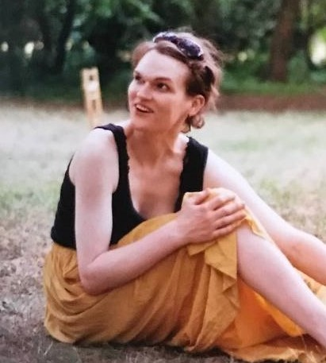

I'm a [PhD student](https://www.birmingham.ac.uk/schools/psychology/people/dr-students/watkins-freya.aspx) in psycholinguistics at the [University of Birmingham](http://www.birmingham.ac.uk/index.aspx), based in the [School of Psychology](https://www.birmingham.ac.uk/schools/psychology/index.aspx).

I am supervised by [Dr Robin Thompson](https://www.birmingham.ac.uk/schools/psychology/people/profile.aspx?ReferenceId=71086) in the [Multimodal Multilingual Language Processing Lab](https://m2l2lab.com) 
& [Dr Bodo Winter](https://www.bodowinter.com) in the [Department of English Language and Linguistics](https://www.birmingham.ac.uk/schools/edacs/departments/englishlanguage/index.aspx).

My postgraduate study is funded by a 1+3 studentship from the [Economic and Social Research Council](https://esrc.ukri.org/).  

This website was created in RStudio and GitHub following a [psyTeachR](https://psyteachr.github.io/index.html) [tutorial](https://debruine.github.io/tutorials/webpages.html) created by [Lisa DeBruine](https://debruine.github.io/).